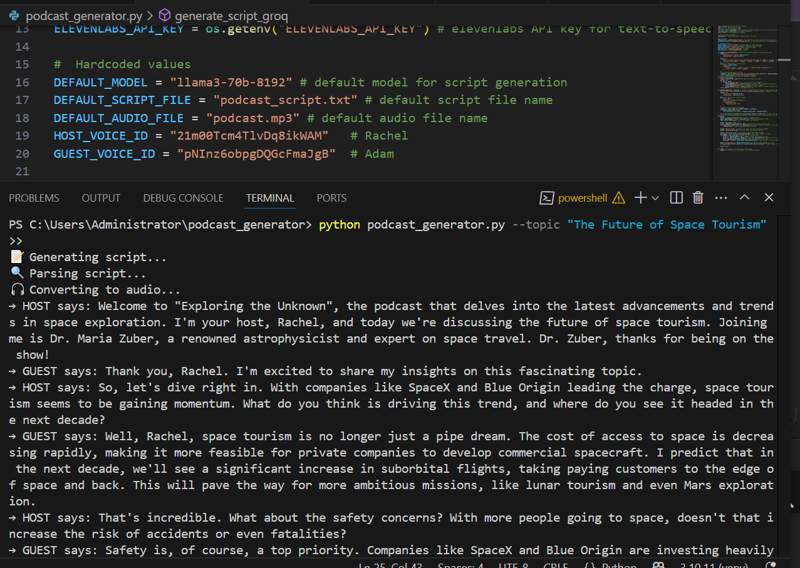

# 🎙️ AI Podcast Generator

This project automatically generates a podcast episode from a given topic using:

- 💬 Script generation via Groq's LLaMA 3 model (`llama3-70b-8192`)
- 🗣️ Text-to-speech conversion using **gTTS** (Google Text-to-Speech)

> 🧠 Previously used **ElevenLabs TTS**, but due to free-tier limits, the fallback is now `gTTS`, which works reliably and freely.

---

## 📌 Features

- Command-line interface for flexible use
- Generates a 3x3 dialog podcast between a Host and a Guest
- Outputs a podcast script file and audio file
- Supports different LLM models (Groq-supported)

---

## 🚀 How to Use

### 1️⃣ Install Requirements

Make sure you have Python 3.7+ installed, then run:

```
pip install -r requirements.txt
```
2️⃣ Setup Environment
Create a .env file and add your Groq API key:
```

GROQ_API_KEY=your_groq_key_here
```
Get your free key at: https://console.groq.com/

3️⃣ Run the Generator
Basic usage:
```

python podcast_generator.py --topic "Marine Life Podcast"
```
Custom output:
```

python podcast_generator.py --topic "Future of Renewable Energy" \
--output_script_file "renewable_script.txt" \
--output_audio_file "renewable_audio.mp3" \
--llm_model "llama3-70b-8192"
```
🖼️ Screenshots
📥 How to run the code
<p align="center">  </p> <p align="center">  </p> <p align="center">  </p>
📜 Sample Generated Script
<p align="center">  </p>
⚙️ Tech Stack
🧠 Groq LLaMA3

🔊 gTTS - Google Text-to-Speech

🎛️ Pydub

🐍 Python 3

📌 Notes
Previously used ElevenLabs for high-quality voices (Rachel and Adam), but free-tier voice generation is now blocked due to detection of "unusual activity."

Switched to gTTS for open and reliable text-to-speech..lkijhy7
📄 License
MIT License
