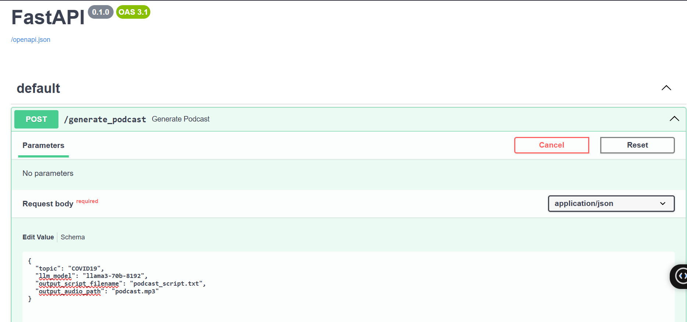
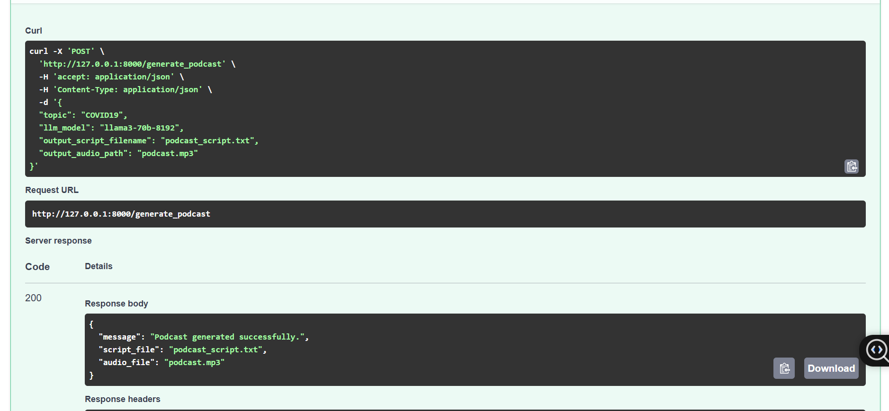

**🎙️ AI Podcast Generator**


This project uses LLMs via Groq API, gTTS, and FastAPI to generate a podcast script and corresponding audio on any topic. You can interact with the service through a RESTful API powered by FastAPI.

📁 Project Structure
css
Copy
Edit
.
├── images/
│   ├── p-5.PNG
│   └── p-6.PNG
├── podcast_generator.py
├── main.py
├── requirements.txt
├── .env
└── README.md
⚙️ Setup Instructions
1. ✅ Clone the Repository
```
git clone https://github.com/FatimaRana50/AI_Podcast_Generator/tree/fastapi-changes
cd ai-podcast-generator
```
2. 🐍 Create Virtual Environment (recommended)
```
# Windows
python -m venv venv
venv\Scripts\activate


# Linux/macOS
python -m venv venv
source venv/bin/activate
```
3. 📦 Install Dependencies
```
pip install -r requirements.txt
```
4. 🔐 Configure Environment Variables
Create a .env file in the root directory with the following content:

```
GROQ_API_KEY=your_groq_api_key_here
```
Replace your_groq_api_key_here with your actual Groq API key.

🚀 Running the Application
Start the FastAPI server using uvicorn:

```
uvicorn main:app --reload
```
Once running, open your browser to:

```
http://127.0.0.1:8000/docs
```
This opens the interactive Swagger UI where you can test the API.

🔄 Using the API
▶️ POST /generate_podcast
Request Body:
```
{
  "topic": "Mental Health in Teens",
  "llm_model": "llama3-70b-8192",
  "output_script_filename": "podcast_script.txt",
  "output_audio_path": "podcast.mp3"
}
```
Response:
```
{
  "message": "Podcast generated successfully.",
  "script_file": "podcast_script.txt",
  "audio_file": "podcast.mp3"
}
```
📚 Example Use Cases
🎧 Content Creation: Quickly generate podcast episodes on trending topics

📘 Education: Create learning materials in podcast format

🧪 Prototyping: Test podcast concepts before professional recording

♿ Accessibility: Generate audio content from text-based topics

🧠 How It Works
You send a topic via a POST request to /generate_podcast.

The app calls the Groq LLM API (e.g., llama3-70b) to generate a podcast script with 3 exchanges between HOST and GUEST.

The script is parsed and split by speaker.

Each line is converted to speech using gTTS.

All audio clips are merged into a final podcast .mp3 file.

📷 Screenshots
✅ API Test in Swagger UI
<p align="center">  </p> <p align="center">  </p>
🛠️ Dependencies
See requirements.txt for the full list. Key libraries include:

fastapi – Web framework

uvicorn – ASGI server

python-dotenv – Loads environment variables from .env

gTTS – Google Text-to-Speech

pydub – Audio merging/processing

requests – API calls to Groq LLM endpoint

🤝 Contributing
Contributions are welcome! Please consider submitting:

🐛 Bug fixes

✨ New features

📝 Documentation improvements

Open an issue or PR to get started!

📜 License
This project is licensed under the MIT License.
