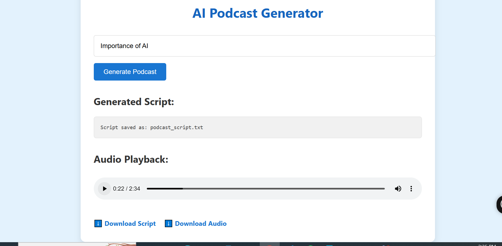
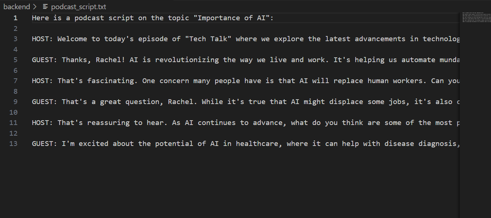

# 🎙️ AI Podcast Generator

This project uses **LLMs (via Groq API)**, **gTTS**, and **FastAPI** to generate a podcast script and audio for any given topic. You can interact with the service using a **simple web-based frontend** or a RESTful API (via Swagger UI).

---

## 📁 Project Structure

.
├── images/
│ ├── p-5.PNG # Swagger Input Screenshot
│ ├── p-6.PNG # Swagger Output Screenshot
│ ├── p-7.PNG # Frontend UI Screenshot
│ └── p-8.PNG # Script Output Screenshot
├── static/
│ ├── index.html
│ ├── style.css
│ └── script.js
├── podcast_generator.py
├── main.py
├── requirements.txt
├── .env
└── README.md


---

## ⚙️ Setup Instructions

### 1. ✅ Clone the Repository

```bash
git clone https://github.com/FatimaRana50/AI_Podcast_Generator.git
cd AI_Podcast_Generator
```
2. 🐍 Create a Virtual Environment
```t
# Windows
python -m venv venv
venv\Scripts\activate

# Linux/macOS
python -m venv venv
source venv/bin/activate
```
3. 📦 Install Dependencies
```
pip install -r requirements.txt
```
4. 🔐 Configure Environment Variables
Create a .env file in the root directory:

```
GROQ_API_KEY=your_groq_api_key_here
```
🚀 Running the Application
1. 🖥️ Start the FastAPI Backend Server
```
uvicorn main:app --reload
Visit:

Swagger UI (API interface): http://127.0.0.1:8000/docs

Frontend UI (web form): http://127.0.0.1:8000/
```

🔄 Using the API
▶️ POST /generate_podcast
Request Body:

```
{
  "topic": "Mental Health in Teens",
  "llm_model": "llama3-70b-8192",
  "output_script_filename": "podcast_script.txt",
  "output_audio_path": "podcast.mp3"
}
```
Response:

```
{
  "message": "Podcast generated successfully.",
  "script_file": "podcast_script.txt",
  "audio_file": "podcast.mp3"
}
```
🧠 How It Works
You enter a topic.

The LLM (e.g., llama3-70b) generates a 3-part dialogue script (HOST vs GUEST).

Each line is passed to gTTS to convert to speech.

All audio clips are merged using pydub into one .mp3 file.

Final script and audio are served via UI or API.

📷 API Preview (Swagger)
<p align="center">  </p> <p align="center">  </p>
🌐 UI Preview (Web Interface)
<p align="center">  </p> <p align="center">  </p>
📚 Example Use Cases
🎧 Content Creation: Quickly produce podcasts on trending topics

📘 Education: Generate teaching materials in audio format

🧪 Prototyping: Try podcast ideas before professional recording

♿ Accessibility: Convert text topics into spoken content

🛠️ Key Dependencies
Package	Purpose
fastapi	Web API backend
uvicorn	ASGI server
python-dotenv	Environment variable loading
gTTS	Text-to-speech
pydub	Audio processing and merging
requests	API calls to Groq LLM endpoint

🤝 Contributing
Contributions are welcome! Feel free to submit:

🐛 Bug fixes

✨ New features

📝 Documentation improvements

Open a PR or issue to get started.
